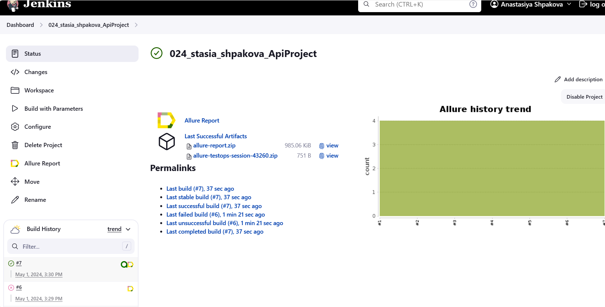
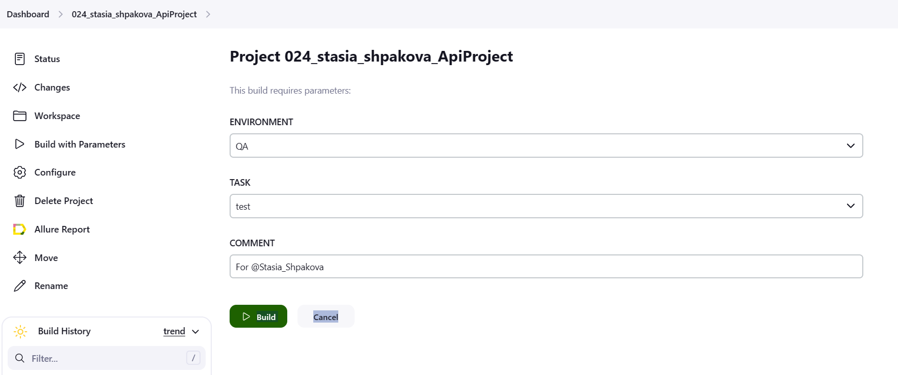
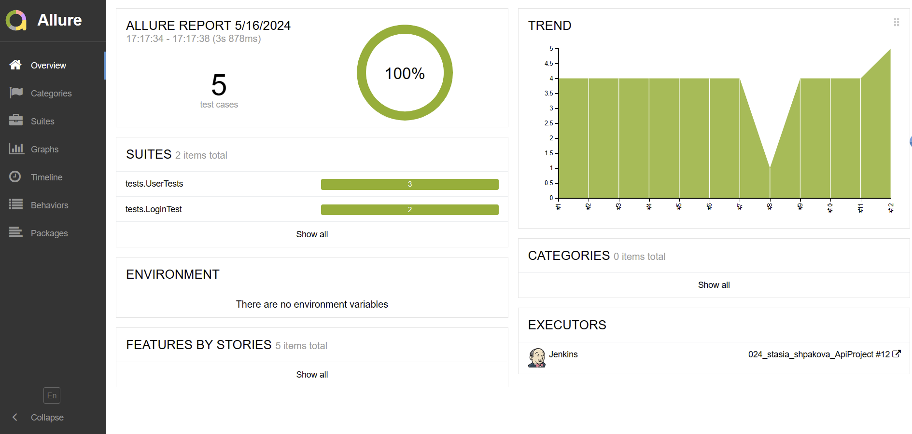
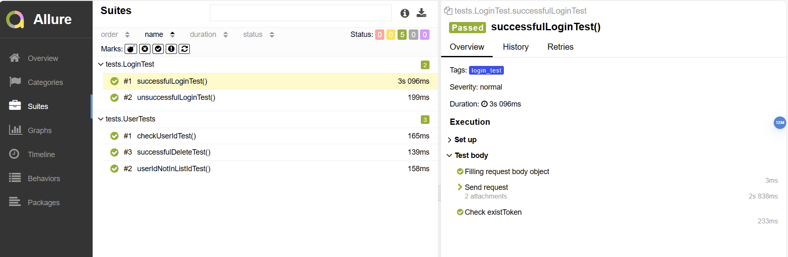
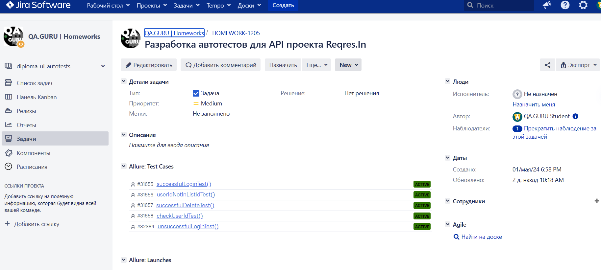

# Проект по автоматизации тестирования API на <a target="_blank" href="https://reqres.in/">Reqres.In</a>

## Технологии и инструменты

<p  align="center">

<a href="https://www.jetbrains.com/idea/"></a>
<a href="https://www.java.com/"></a>
<a href="https://selenide.org/"></a>
<a href="https://gradle.org/"></a>
<a href="https://junit.org/junit5/"></a>
<a href="https://github.com/"></a>
<a href="https://allurereport.org/"></a>
<a href="https://qameta.io/"></a>
<a href="https://www.jenkins.io/"></a>
<a href="https://www.atlassian.com/ru/software/jira"></a>
</p>

### Автотесты написаны на <code>Java</code> с использованием <code>API RestAssured</code> 

- Gradle — используется как инструмент автоматизации сборки.
- Jenkins — CI/CD для удаленного запуска тестов.
- Allure TestOps - как система управления тестированием.
- Осуществлена интеграция с Allure TestOps и Jira.
- По итогу прохождения автотестов генерируется Allure отчет. 

<a id="cases"></a>
<a name="Список проверок, реализованных в автотестах">**Список проверок, реализованных в автотестах:**</a>
* Проверка userId переданного пользователя
* Проверка статус кода при передаче пользователя отсутствующего в базе
* Успешная операция логина
* Неуспешная операция логина с пустым паролем
* Успешное удаление пользователя

## Запуск тестов
### Локальный запуск тестов

Для запуска следует открыть IntelliJ IDEA и выполнить в терминале:
```
gradle clean test
```

или

```
gradle clean test -Denv=local
```

### Удалённый запуск через Jenkins
```bash  
clean ${TASK} 
"-Denv=${ENVIRONMENT}"  
```
***Tasks для запуска тестов:***
- *test - запуск всех api тестов*
- *user_test - запуск api тестов на проверку пользователя*
- *login_test - запуск api тестов на авторизацию*

### Сборка тестов в  <a target="_blank" href="https://jenkins.autotests.cloud/job/024_stasia_shpakova_ApiProject/">Jenkins</a>

<p align="center">

</p>

>Для запуска сборки необходимо перейти в раздел `Build with Parameters` и нажать кнопку `Build`

<p align="center">

</p>

## Интеграция с <b><a target="_blank" href="https://jenkins.autotests.cloud/job/024_stasia_shpakova_ApiProject/1/allure/#">Allure report</a></b>
#### Результаты прохождения тестов
`ALLURE REPORT` - отображает дату и время прохождения тестов, общее количество запущенных тестов, а также процент и количество успешных и упавших тестов <br/>
`TREND` - отображает тенденцию выполнения тестов для всех запусков <br/>
`SUITES` - отображает распределение тестов по сьютам <br/>



#### Развернутый результат прохождения тестов:
1. Общий список автотестов
2. Содержание автотеста
3. Вложения



## Интеграция с <b><a target="_blank" href="https://allure.autotests.cloud/project/4176/test-cases/31657?treeId=0">Allure TestOps</a></b>

>Результаты прохождения тестов
>


## Интеграция с <b><a target="_blank" href="https://jira.autotests.cloud/browse/HOMEWORK-1205">Jira</a></b>

>В Jira создана задача и в разделе `Allure:Test Cases` отображаются интегрированные автоматизированные тесты
>



